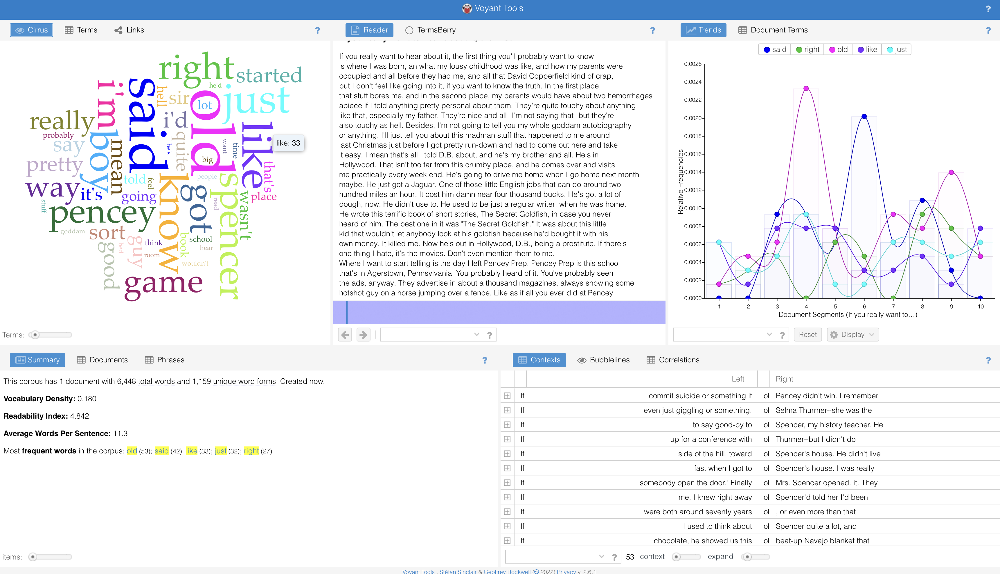

# Voyant

## Source:

[Voyant Tools. Stéfan & Geoffery Rockwell. v. 2.6.0.](https://voyant-tools.org)

### Acknowledgement:

This reflection was done with reference to the following source:

- https://library.villanova.edu/application/files/9815/8739/5480/VoyantToolsParadiseLostTutorial.pdf

## Background

Voyant Tools is a web-based text reading and analysis environment. It is a scholarly project that is designed to facilitate reading and interpretive practices for digital humanities students and scholars as well as for the general public.

Voyant has a large, international user base: in October 2016 alone, Voyant's main server had 81,686 page views originating from 156 countries, invoking the tool 1,173,252 time

## Usage

What we can do with Voyant:

- Use it to learn how computers-assisted analysis works. Check out our examples that show you how to do real academic tasks with Voyant.
- Use it to study texts that you find on the web or texts that you have carefully edited and have on your computer.
- Use it to add functionality to your online collections, journals, blogs or web sites so others can see through your texts with analytical tools.
- Use it to add interactive evidence to your essays that you publish online. Add interactive panels right into your research essays (if they can be published online) so your readers can recapitulate your results.
- Use it to develop your own tools using our functionality and code.

## Example



From this picture, we can see 5 different sections of the tool. We have 5 diffent text analysis tools available for us:

- **Cirrus**: A word cloud that visualize top frequency words in the analyzed text. Pretty straight forward here: the most frequently appeared are positioned in the center with the largest size, and we have smaller words trying to fit in the spaces between the larger words. It is worth noticing that the relative positions of the words are not static.
- **Reader**: Display copied text, but not all of it. Data is fetched and display as we scroll down. Some small features include word count display upon hovering over a word.
- **Trend**: Display distribution plot representing the frequency of terms across copied texts. Some small features include clicking the words in the legend to toggle visibility, or hovering a point on the plot will trigger a box with information about the word and the frequency
- **Summary**: A holistic view of copied text, including info such as total number of words, unique words, average words per sentences, most frequent words
- **Contexts**: Display the occurences of each keyword with surrounding words. The table has 4 columns: _Document_ (displays keywords and surrounding words), _Left_ (display left contextual words to the left of the keyword), _Term_ (the word itself), _Right_ (display right contextual words to the left of the keyword)

## Reflection

The tool seems to be doing pretty well the work it claims to do. We can quickly find the occurences of each word and how are the words commonly used (i.e in what context). A feature I noticed is we can include multiple text sources, and the tool will do the text analysis for each source separately. This is a small feature but can really help smoothen the work flow. Another feature is ease in sharing current analysis with other people. Voyant tool allows generation of a static link that can be shared, allowing easy collaboration on dashboard.

```python

```
