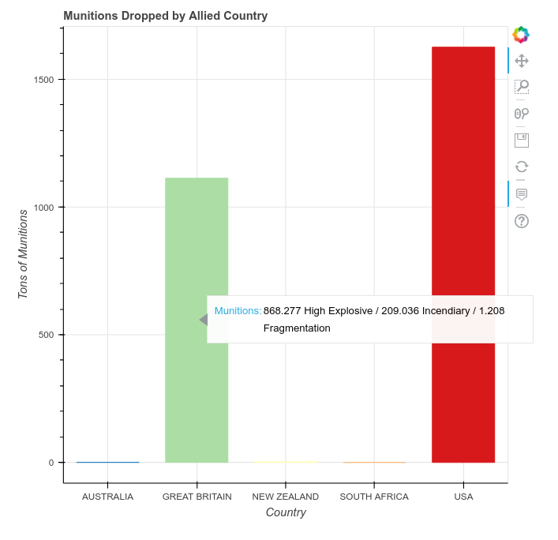
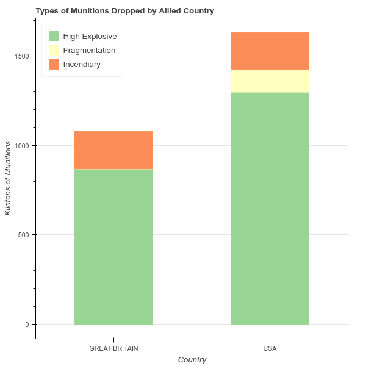
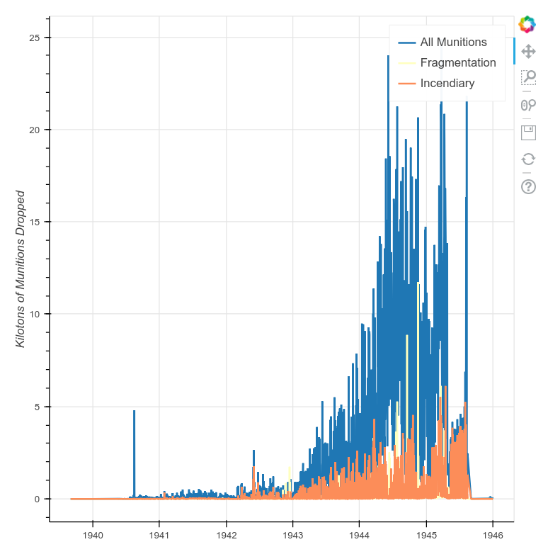
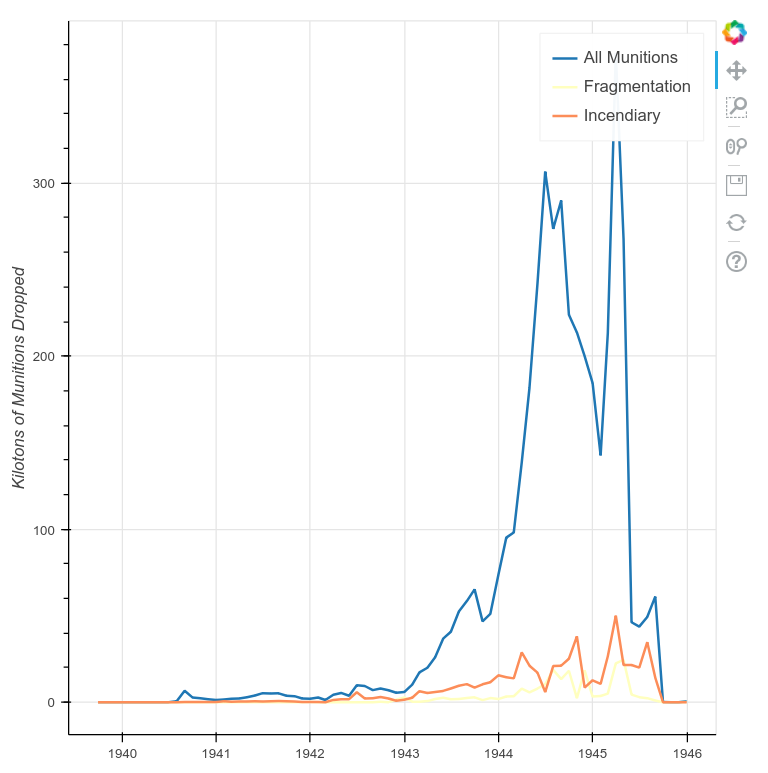

# Visualizing Data with Bokeh and Pandas

In this lesson I will demonstrate how to visually explore and present data in Python by using the Bokeh and Pandas libraries.

## Source

https://programminghistorian.org/en/lessons/visualizing-with-bokeh

## Reflection

Data visualization has become an integral part of of a lot of data intensive field, with its ability to make data much more understandable and accessable. With the right visualization, we can convert data, which is just numbers, into something much more digestible and can even be used to gear towards conclusion we want to draw from the data. With its rise, there have also been new instances of how data visualization has been used to mislead people, using its own blade against iself. However, it is undeniable that this is a field with a lot of potential, and we can see how multiple fields, such as psychology, can be leveraged to improve on current models. This lession covers how we can use Bokeh and Pandas

The tutorial seems very straighforward, but I originally got a lot of issue with the code, and a lot of hacky patches was needed, until I realized I have been using the wrong python path, then everything was smooth. The code is straightforward, and the libraries and document were helpful. A key takeaway for me is how we need to pick the right visualization for the data in order to get holistic and unbiased view of the given data.

## Code

```python
import warnings
warnings.filterwarnings('ignore')

```

## The Basics of Bokeh

### My First Plot

```python
from bokeh.plotting import figure, show
x = [1, 3, 5, 7]
y = [2, 4, 6, 8]

p = figure()

p.circle(x, y, size=10, color='red', legend='circle')
p.line(x, y, color='blue', legend='line')
p.triangle(y, x, color='gold', size=10, legend='triangle')
p.legend.click_policy='hide'

show(p)

```

<div class="bk-root" id="da01ca48-a5d0-4684-8510-7a3c67dac63e" data-root-id="1671"></div>

### Load Data in Pandas

```python
import pandas as pd
df = pd.read_csv('thor_wwii.csv')
df.columns.tolist()

```

    ['MSNDATE',
     'THEATER',
     'COUNTRY_FLYING_MISSION',
     'NAF',
     'UNIT_ID',
     'AIRCRAFT_NAME',
     'AC_ATTACKING',
     'TAKEOFF_BASE',
     'TAKEOFF_COUNTRY',
     'TAKEOFF_LATITUDE',
     'TAKEOFF_LONGITUDE',
     'TGT_COUNTRY',
     'TGT_LOCATION',
     'TGT_LATITUDE',
     'TGT_LONGITUDE',
     'TONS_HE',
     'TONS_IC',
     'TONS_FRAG',
     'TOTAL_TONS']

### The Bokeh ColumnDataSource

```python
import pandas as pd
from bokeh.plotting import figure, output_notebook, show
import bokeh.io
from bokeh.models import ColumnDataSource
from bokeh.models.tools import HoverTool


bokeh.io.reset_output()
bokeh.io.output_notebook()

df = pd.read_csv('thor_wwii.csv')
sample = dict(df.sample(50))
source = ColumnDataSource(sample)
p = figure()
p.circle(x='TOTAL_TONS', y='AC_ATTACKING',
         source=source,
         size=10, color='green')

p.title.text = 'Attacking Aircraft and Munitions Dropped'
p.xaxis.axis_label = 'Tons of Munitions Dropped'
p.yaxis.axis_label = 'Number of Attacking Aircraft'

hover = HoverTool()
hover.tooltips=[
    ('Attack Date', '@MSNDATE'),
    ('Attacking Aircraft', '@AC_ATTACKING'),
    ('Tons of Munitions', '@TOTAL_TONS'),
    ('Type of Aircraft', '@AIRCRAFT_NAME')
]

p.add_tools(hover)

show(p)


```

<div class="bk-root">
        <a href="https://bokeh.org" target="_blank" class="bk-logo bk-logo-small bk-logo-notebook"></a>
        <span id="2086">Loading BokehJS ...</span>
    </div>

<div class="bk-root" id="1890ed87-8b35-4a12-b29d-3e8ea2375dfd" data-root-id="2088"></div>

### Categorical Data and Bar Charts: Munitions Dropped by Country

```python
# munitions_by_country.py
import pandas as pd
from bokeh.plotting import figure, output_file, show
from bokeh.models import ColumnDataSource

from bokeh.models.tools import HoverTool
from bokeh.palettes import Spectral5
from bokeh.transform import factor_cmap
output_file('munitions_by_country.html')

# Read in to dataframe
df = pd.read_csv('thor_wwii.csv')

# Compute kilotons of munitions (grouped by country)
grouped = df.groupby('COUNTRY_FLYING_MISSION')[['TOTAL_TONS', 'TONS_HE', 'TONS_IC', 'TONS_FRAG']].sum() / 1000

source = ColumnDataSource(grouped)
countries = source.data['COUNTRY_FLYING_MISSION'].tolist()
p = figure(x_range=countries)
color_map = factor_cmap(field_name='COUNTRY_FLYING_MISSION',
                    palette=Spectral5, factors=countries)
p.vbar(x='COUNTRY_FLYING_MISSION', top='TOTAL_TONS', source=source, width=0.70, color=color_map)

# Adjust axis labels
p.title.text ='Munitions Dropped by Allied Country'
p.xaxis.axis_label = 'Country'
p.yaxis.axis_label = 'Kilotons of Munitions'

# Make plot interactive
hover = HoverTool()
hover.tooltips = [
    ("Totals", "@TONS_HE High Explosive / @TONS_IC Incendiary / @TONS_FRAG Fragmentation")]
hover.mode = 'vline'
p.add_tools(hover)

# Finally, print the plot
show(p)

```



<div class="bk-root" id="6687126e-90c1-4909-bfb7-9ea883323dec" data-root-id="2195"></div>

### Stacked Bar Charts and Sub-sampling Data: Types of Munitions Dropped by Country

```python
# munitions_by_country_stacked.py
import pandas as pd
from bokeh.plotting import figure, output_file, show
from bokeh.models import ColumnDataSource
from bokeh.palettes import Spectral3
output_file('types_of_munitions.html')

df = pd.read_csv('thor_wwii.csv')

# filter data for only USA and Great Britain
filter = df['COUNTRY_FLYING_MISSION'].isin(('USA','GREAT BRITAIN'))
df = df[filter]

# group data and convert to kilotons
grouped = df.groupby('COUNTRY_FLYING_MISSION')['TONS_IC', 'TONS_FRAG', 'TONS_HE'].sum() / 1000
source = ColumnDataSource(grouped)
countries = source.data['COUNTRY_FLYING_MISSION'].tolist()
p = figure(x_range=countries)

# ensure figure uses categorical data for x-axis
p.vbar_stack(stackers=['TONS_HE', 'TONS_FRAG', 'TONS_IC'],
             x='COUNTRY_FLYING_MISSION', source=source,
             legend = ['High Explosive', 'Fragmentation', 'Incendiary'],
             width=0.5, color=Spectral3)

# create a stacked bar chart and show it
p.title.text ='Types of Munitions Dropped by Allied Country'
p.legend.location = 'top_left'

p.xaxis.axis_label = 'Country'
p.xgrid.grid_line_color = None	#remove the x grid lines

p.yaxis.axis_label = 'Kilotons of Munitions'

show(p)
```



<div class="bk-root" id="c1775dce-e4fc-46ce-af1e-c420ea118230" data-root-id="2468"></div>

### Time-Series and Annotations: Bombing Operations over Time

```python
# my_first_timeseries.py
import pandas as pd
from bokeh.plotting import figure, output_file, show
from bokeh.models import ColumnDataSource
from bokeh.palettes import Spectral3
output_file('simple_timeseries_plot.html')

df = pd.read_csv('thor_wwii.csv')

# make sure MSNDATE is a datetime format
df['MSNDATE'] = pd.to_datetime(df['MSNDATE'], format='%m/%d/%Y')

grouped = df.groupby('MSNDATE')['TOTAL_TONS', 'TONS_IC', 'TONS_FRAG'].sum() / 1000

source = ColumnDataSource(grouped)

p = figure(x_axis_type='datetime') # ensure x-axis represents time

p.line(x='MSNDATE', y='TOTAL_TONS', line_width=2, source=source, legend='All Munitions')
p.line(x='MSNDATE', y='TONS_FRAG', line_width=2, source=source, color=Spectral3[1], legend='Fragmentation')
p.line(x='MSNDATE', y='TONS_IC', line_width=2, source=source, color=Spectral3[2], legend='Incendiary')

p.yaxis.axis_label = 'Kilotons of Munitions Dropped'

show(p)
```



<div class="bk-root" id="d1fdc516-f278-4417-9dc5-561369d565b3" data-root-id="2804"></div>

### Resampling Time-Series Data

```python
import pandas as pd
from bokeh.plotting import figure, output_file, show
from bokeh.models import ColumnDataSource
from bokeh.palettes import Spectral3
output_file('simple_timeseries_plot.html')

df = pd.read_csv('thor_wwii.csv')

# make sure MSNDATE is a datetime format
df['MSNDATE'] = pd.to_datetime(df['MSNDATE'], format='%m/%d/%Y')

grouped = df.groupby(pd.Grouper(key='MSNDATE', freq='M'))['TOTAL_TONS', 'TONS_IC', 'TONS_FRAG'].sum() / 1000

source = ColumnDataSource(grouped)

p = figure(x_axis_type='datetime') # ensure x-axis represents time

p.line(x='MSNDATE', y='TOTAL_TONS', line_width=2, source=source, legend='All Munitions')
p.line(x='MSNDATE', y='TONS_FRAG', line_width=2, source=source, color=Spectral3[1], legend='Fragmentation')
p.line(x='MSNDATE', y='TONS_IC', line_width=2, source=source, color=Spectral3[2], legend='Incendiary')

p.yaxis.axis_label = 'Kilotons of Munitions Dropped'

show(p)
```



<div class="bk-root" id="4a7f7504-fcc4-4f01-b132-2c9e4ce9df8c" data-root-id="3421"></div>

### Annotating Trends in Plots

```python
# annotating_trends.py
import pandas as pd
from bokeh.plotting import figure, output_file, show
from bokeh.models import ColumnDataSource
from bokeh.models import BoxAnnotation
from datetime import datetime
from bokeh.palettes import Spectral3
output_file('eto_operations.html')

df = pd.read_csv('thor_wwii.csv')

# specify date ranges to annotate
box_left = pd.to_datetime('6-6-1944')
box_right = pd.to_datetime('16-12-1944')

#filter for the European Theater of Operations
filter = df['THEATER']=='ETO'
df = df[filter]

df['MSNDATE'] = pd.to_datetime(df['MSNDATE'], format='%m/%d/%Y')
group = df.groupby(pd.Grouper(key='MSNDATE', freq='M'))['TOTAL_TONS', 'TONS_IC', 'TONS_FRAG'].sum()
group = group / 1000

source = ColumnDataSource(group)

p = figure(x_axis_type="datetime")

p.line(x='MSNDATE', y='TOTAL_TONS', line_width=2, source=source, legend='All Munitions')
p.line(x='MSNDATE', y='TONS_FRAG', line_width=2, source=source, color=Spectral3[1], legend='Fragmentation')
p.line(x='MSNDATE', y='TONS_IC', line_width=2, source=source, color=Spectral3[2], legend='Incendiary')

p.title.text = 'European Theater of Operations'

p.yaxis.axis_label = 'Kilotons of Munitions Dropped'

# add annotation to the plot
box = BoxAnnotation(left=box_left, right=box_right,
                    line_width=1, line_color='black', line_dash='dashed',
                    fill_alpha=0.2, fill_color='orange')

p.add_layout(box)

show(p)
```

<div class="bk-root" id="78dbd177-f336-40e4-90a9-22b84ba3212b" data-root-id="4061"></div>

### Spatial Data: Mapping Target Locations

```python
# target_locations.py
import pandas as pd
from bokeh.plotting import figure, output_file, show
from bokeh.models import ColumnDataSource, Range1d
from bokeh.layouts import layout
from bokeh.palettes import Spectral3
from bokeh.tile_providers import get_provider
from pyproj import Transformer
output_file('mapping_targets.html')

# helper function to convert lat/long to easting/northing for mapping
# this relies on functions from the pyproj library
def LongLat_to_EN(long, lat):
    try:
        transformer = Transformer.from_crs('epsg:4326', 'epsg:3857')
        easting, northing = transformer.transform(long, lat)
        return easting, northing
    except:
        return None, None

# read into dataframe
df = pd.read_csv("thor_wwii.csv")

df['E'], df['N'] = zip(
    *df.apply(lambda x: LongLat_to_EN(x['TGT_LONGITUDE'], x['TGT_LATITUDE']), axis=1))

# group data
grouped = df.groupby(['E', 'N'])[['TONS_IC', 'TONS_FRAG']].sum().reset_index()

filter = grouped['TONS_FRAG'] != 0
grouped = grouped[filter]
source = ColumnDataSource(grouped)

# specify ranges for plot
left = -2150000
right = 18000000
bottom = -5300000
top = 11000000

p = figure(x_range=Range1d(left, right), y_range=Range1d(bottom, top))

provider = get_provider('CARTODBPOSITRON')
p.add_tile(provider)
p.circle(x='E', y='N', source=source, line_color='grey', fill_color='yellow')
p.axis.visible = False

show(p)
```

<div class="bk-root" id="dbf7ce0e-3768-4b91-9366-0ab3fc529b97" data-root-id="4728"></div>

```python

```
